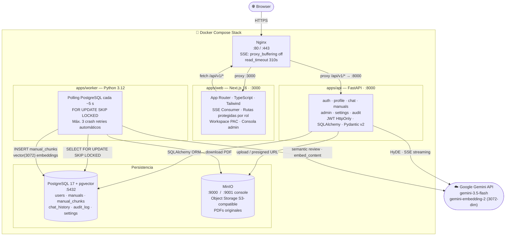
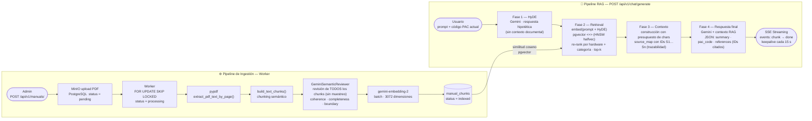

# RC7 Programming Assistant

> Asistente web especializado en programación PAC para robots DENSO con controlador RC7.
> Genera código PAC listo para copiar en WinCaps III, respaldado por un pipeline RAG
> de cuatro fases con HyDE y streaming SSE sobre manuales oficiales DENSO.

---

## Arquitectura

### Topología de servicios



> **Nginx solo existe en producción** (`docker-compose.prod.yml`, TLS + reverse proxy).
> En el compose de **desarrollo** (`docker-compose.yml`) no hay nginx: el browser pega a
> `web:3000` y el proxy interno de Next.js reenvía `/api/v1/*` a `api:8000`.

### Pipelines — Ingestión y RAG



| Componente | Directorio | Responsabilidad |
|---|---|---|
| **Frontend** | `apps/web/` | Login, workspace del asistente, consola admin, SSE consumer |
| **Backend** | `apps/api/` | Auth JWT, RAG pipeline, SSE streaming, CRUD, audit |
| **Worker** | `apps/worker/` | Ingestión PDF: parse → chunk → revisión Gemini → embed → pgvector |
| **PostgreSQL + pgvector** | — | Datos transaccionales + almacenamiento vectorial |
| **MinIO** | — | PDFs originales (API compatible con S3) |
| **Nginx** | `infra/nginx/` | Reverse proxy; buffering desactivado para rutas SSE |

---

## Módulos de la API

| Módulo | Prefix | Descripción |
|---|---|---|
| `health` | `/api/v1/health` | Healthcheck |
| `auth` | `/api/v1/auth` | Login, sesión JWT HttpOnly, logout, switch-role |
| `profile` | `/api/v1/profile` | Perfil y contraseña del usuario autenticado |
| `chat` | `/api/v1/chat` | Pipeline RAG con SSE streaming, historial |
| `manuals` | `/api/v1/manuals` | CRUD de manuales + MinIO + trigger de ingestión + cancelación |
| `admin` | `/api/v1/admin` | Estado del sistema, usuarios, permisos de rol |
| `settings` | `/api/v1/admin/settings` | Parámetros configurables de Gemini/RAG en DB |
| `audit` | `/api/v1/admin/audit` | Registro inmutable de eventos del sistema |

---

## Requisitos previos

- [Docker](https://docs.docker.com/get-docker/) >= 24.0
- [Docker Compose](https://docs.docker.com/compose/install/) >= 2.20
- Clave de API de Google Gemini ([obtener aquí](https://aistudio.google.com/))

---

## Inicio rápido

```bash
# 1. Clonar
git clone https://github.com/soviedos/rc7_programming_assistant.git
cd rc7_programming_assistant

# 2. Configurar variables de entorno
cp .env.example .env
# Editar .env: GEMINI_API_KEY, JWT_SECRET,
# BOOTSTRAP_ADMIN_EMAIL, BOOTSTRAP_ADMIN_PASSWORD

# 3. Levantar el stack completo
docker compose up --build -d

# 4. Verificar servicios
docker compose ps
curl -s http://localhost:8000/api/v1/health/ | python3 -m json.tool
```

---

## Servicios expuestos

| Servicio | URL | Descripción |
|---|---|---|
| Frontend | http://localhost:3000 | Interfaz web principal |
| API | http://localhost:8000 | Backend REST |
| Swagger UI | http://localhost:8000/docs | Documentación interactiva de la API |
| MinIO Console | http://localhost:9001 | Administración de object storage |
| PostgreSQL | localhost:5432 | Base de datos (acceso directo) |

---

## Variables de entorno

| Variable | Requerida | Default | Descripción |
|---|---|---|---|
| `APP_ENV` | No | `development` | Entorno (`development`, `production`) |
| `PROJECT_NAME` | No | `rc7_programming_assistant` | Nombre del proyecto |
| `BOOTSTRAP_ADMIN_EMAIL` | Sí | — | Email del admin inicial |
| `BOOTSTRAP_ADMIN_PASSWORD` | Sí | — | Contraseña del admin inicial |
| `BOOTSTRAP_ADMIN_NAME` | No | `Administrador RC7` | Nombre visible del admin inicial |
| `JWT_SECRET` | Sí | — | Secreto para firmar tokens JWT (mín. 32 chars) |
| `SESSION_COOKIE_NAME` | No | `rc7_session` | Nombre de la cookie de sesión |
| `SESSION_TTL_MINUTES` | No | `720` | Duración de la sesión (minutos) |
| `POSTGRES_HOST` | No | `postgres` | Host de PostgreSQL |
| `POSTGRES_PORT` | No | `5432` | Puerto de PostgreSQL |
| `POSTGRES_DB` | No | `rc7_assistant` | Nombre de la base de datos |
| `POSTGRES_USER` | No | `postgres` | Usuario de PostgreSQL |
| `POSTGRES_PASSWORD` | Sí* | `postgres` | Contraseña de PostgreSQL (*obligatoria en producción) |
| `MINIO_ENDPOINT` | No | `http://minio:9000` | Endpoint de MinIO |
| `MINIO_ROOT_USER` | No | `minioadmin` | Usuario root de MinIO |
| `MINIO_ROOT_PASSWORD` | Sí* | `minioadmin` | Contraseña root de MinIO (*obligatoria en producción) |
| `MINIO_BUCKET_MANUALS` | No | `rc7-manuals` | Bucket para almacenar PDFs |
| `GEMINI_API_KEY` | Sí | — | Clave de la API de Google Gemini |
| `ENABLE_STREAMING` | No | `true` | Activa SSE streaming en `/chat/generate` |
| `CORS_ORIGINS` | No | `["http://localhost:3000"]` | Orígenes permitidos en CORS |

> En `APP_ENV=production`, las variables marcadas con * y `JWT_SECRET` / `GEMINI_API_KEY`
> son validadas al arrancar — el proceso falla si contienen valores por defecto o débiles.

---

## Testing

```bash
# Backend (pytest, corre contra BD rc7_test auto-creada)
docker compose exec api python -m pytest

# Frontend (vitest)
docker compose exec web npm test

# Worker (pytest)
docker compose exec worker python -m pytest
```

---

## Estructura del repositorio

```text
rc7_programming_assistant/
├── .github/
│   └── workflows/    # CI/CD (deploy.yml)
├── apps/
│   ├── api/          # Backend FastAPI (Python 3.12)
│   ├── web/          # Frontend Next.js 16
│   └── worker/       # Worker de ingestión documental
├── docs/             # Documentación técnica
│   ├── architecture/ # Visión general, decisiones tecnológicas
│   ├── backend/      # Módulos API: endpoints, settings, audit
│   ├── frontend/     # Layout y criterios de UX
│   ├── operations/   # Desarrollo local, testing, despliegue
│   ├── rag/          # Pipeline de ingestión documental
│   └── decisions/    # Architecture Decision Records (ADR)
├── infra/            # Dockerfiles y configuración de servicios
├── logs/             # Logs de api y worker (excluidos del control de versiones)
├── scripts/          # Scripts de backup y migración de datos
├── storage/          # Volúmenes locales (desarrollo)
├── docker-compose.yml
├── docker-compose.prod.yml
├── .env.example      # Template de variables para desarrollo
└── .env.prod.example # Template de variables para producción
```

---

## Documentación

| Documento | Descripción |
|---|---|
| [Arquitectura (diagramas Mermaid)](./docs/architecture/ARCHITECTURE.md) | Componentes, ingestión, RAG, vectorial, auth, secuencias y ER |
| [Arquitectura general](./docs/architecture/overview.md) | Componentes, flujos RAG, audit y settings |
| [Auditoría de código](./docs/audit/CODE_AUDIT.md) | Hallazgos por severidad, limpiezas y propuestas |
| [Documentación vs. código](./docs/audit/DOC_VS_CODE.md) | Tabla de divergencias verificadas/corregidas |
| [Decisiones tecnológicas](./docs/architecture/technology-decisions.md) | ADRs: pgvector, HyDE, SSE, settings en DB |
| [Módulos del backend](./docs/backend/api-modules.md) | Tabla completa de endpoints |
| [Módulo settings](./docs/backend/settings-module.md) | Parámetros configurables y su efecto |
| [Módulo audit](./docs/backend/audit-module.md) | Eventos registrados y API de consulta |
| [Ingestión de manuales](./docs/rag/manual-ingestion.md) | Pipeline worker: parse → chunk → embed |
| [Estructura de carpetas](./docs/architecture/folder-structure.md) | Organización del repositorio |
| [Desarrollo local](./docs/operations/local-development.md) | Guía de arranque y operación |
| [Despliegue en producción](./docs/operations/deployment.md) | Configuración y migración de datos |
| [Testing](./docs/operations/testing.md) | Estrategia y comandos de prueba |

---

## Tecnologías principales

| Capa | Tecnología | Versión mínima |
|---|---|---|
| Frontend | Next.js + React + TypeScript | 16 (`next@16.2.4`, React 19) |
| Backend | FastAPI + SQLAlchemy + Pydantic v2 | Python 3.12+ |
| Worker | Python + google-genai SDK + pypdf | Python 3.12+ |
| Base de datos | PostgreSQL + pgvector (`vector(3072)` · HNSW) | 17+ |
| Object storage | MinIO (S3-compatible) | — |
| Contenedores | Docker + Docker Compose | 24.0+ / 2.20+ |
| IA | Google Gemini 3.5 Flash + gemini-embedding-2 (3072-dim) | — |
| Testing | pytest, Vitest | — |

---

## Licencia

Este proyecto está licenciado bajo [Creative Commons Attribution-NonCommercial 4.0 International (CC BY-NC 4.0)](./LICENSE).

Puedes estudiar y compartir el código con atribución, pero **no está permitido su uso comercial** sin autorización expresa del autor.

© 2026 Sergio Oviedo Seas
