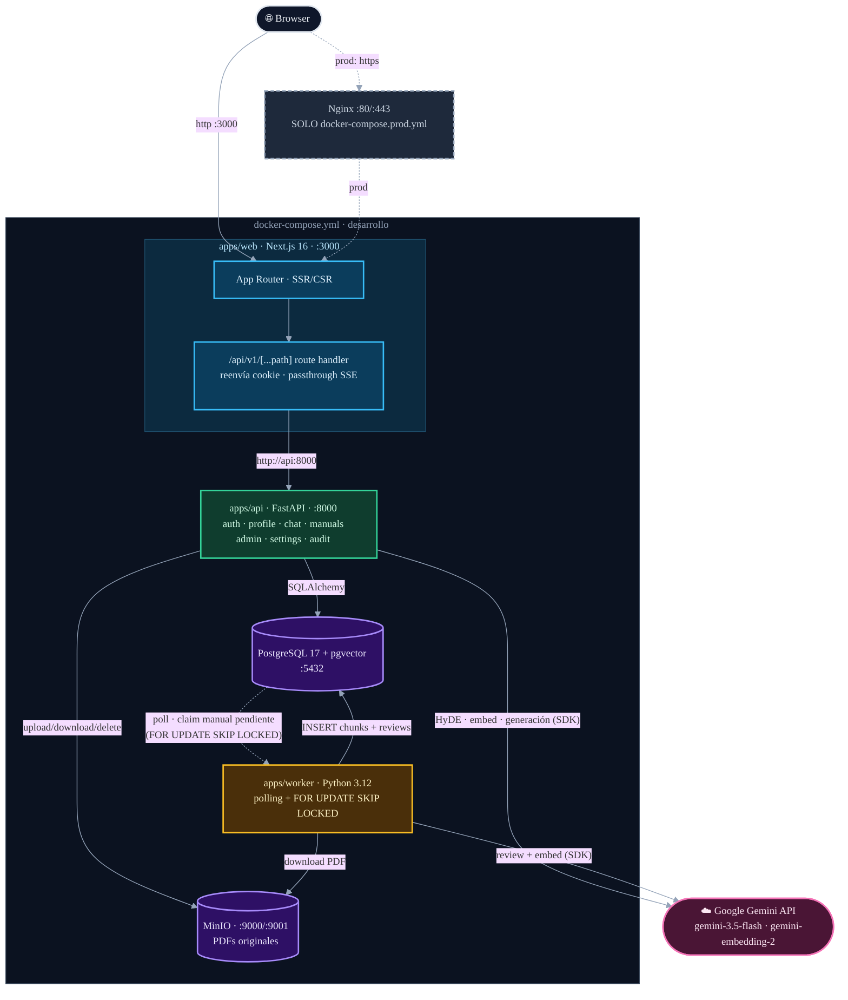
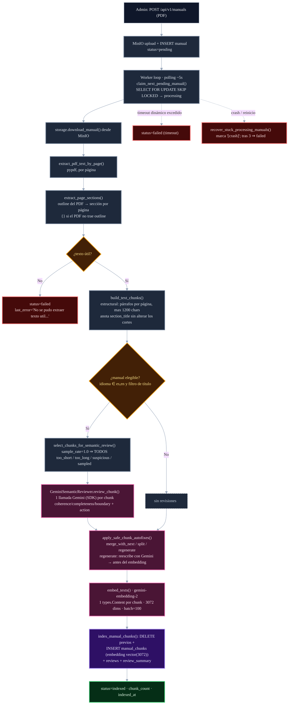
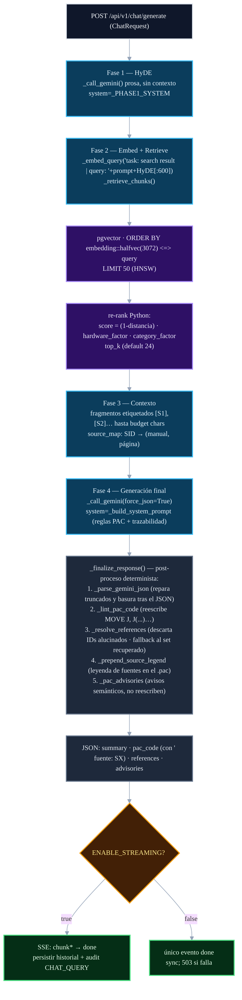
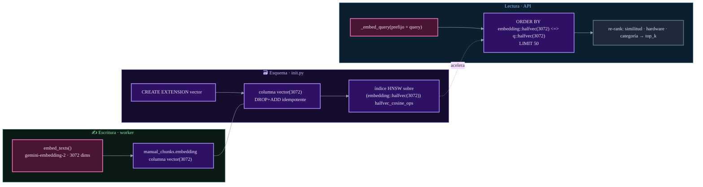
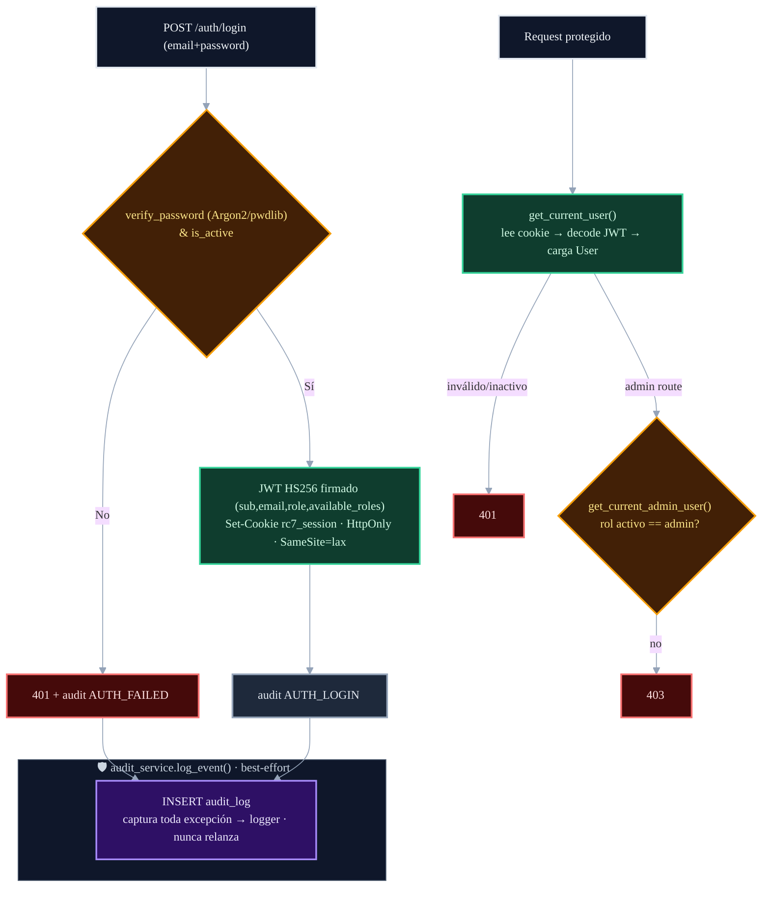
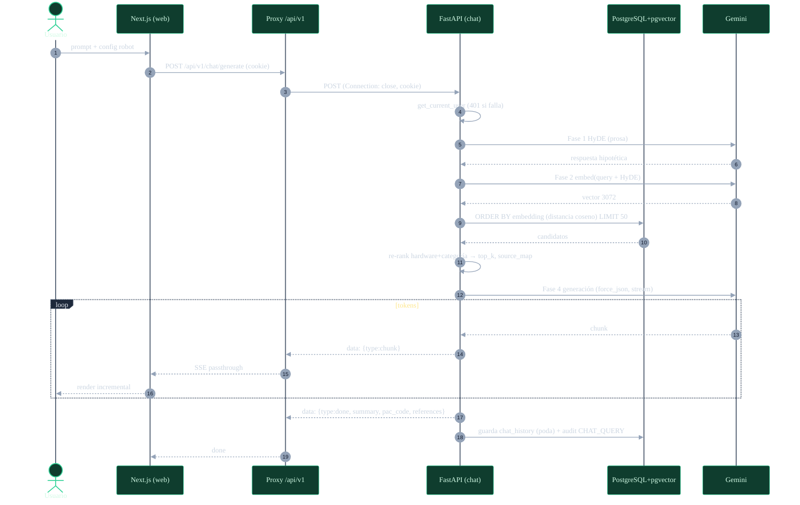
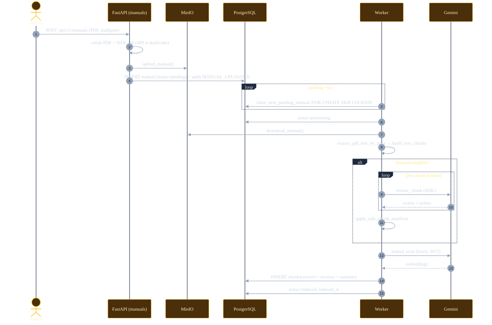
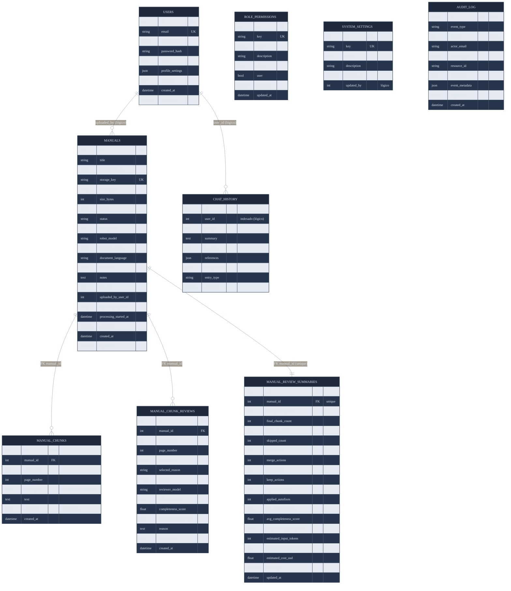

# Arquitectura — RC7 Programming Assistant

> Estos diagramas describen el sistema **como está en el código** (no una versión idealizada).
> Las divergencias con docs anteriores están registradas en
> [docs/audit/DOC_VS_CODE.md](../audit/DOC_VS_CODE.md).

## 1. Componentes y flujos de datos

**Servicios realmente usados:** `web`, `api`, `worker`, `postgres` (imagen `pgvector/pgvector:pg17`),
`minio`. **Nginx existe solo en producción** (`docker-compose.prod.yml`) como terminador TLS/reverse
proxy; en desarrollo no hay nginx y el proxy de Next.js cumple ese rol para `/api/v1/*`.

**Dependencias de código compartidas (no son servicios):**

- `packages/rc7_shared_db/` define una sola vez la `Base` ORM, los tipos
  cross-dialect, los modelos `Manual`/`ManualChunk`/`ManualChunkReview`/
  `ManualReviewSummary` y las migraciones idempotentes (`ensure_manual_columns`).
- `packages/rc7_shared_config/` define `SharedSettings`: la configuración que ambos
  servicios necesitan (Postgres, MinIO, modelos y timeout de Gemini) y las
  validaciones de secretos en producción. Los `Settings` de `api` y `worker`
  heredan de él y declaran solo sus campos propios.
- `packages/rc7_shared_storage/` define `ManualStorageService`: el cliente MinIO
  (subir, descargar y borrar el PDF de un manual). Los `storage.py` de `api` y
  `worker` son re-exports que le inyectan el `settings` de su servicio.

`api` y `worker` instalan los tres paquetes editable en sus imágenes.

---

## 2. Pipeline de ingestión (worker)

Implementación real en [jobs/ingestion.py](../../apps/worker/src/jobs/ingestion.py).

Notas reales: la revisión es **exhaustiva** por defecto (`SEMANTIC_REVIEW_SAMPLE_RATE=1.0`, sin tope);
el autofix `regenerate` **sí** está implementado (reescribe el chunk con Gemini, gated por
`SEMANTIC_REVIEW_REGENERATE_MAX_COHERENCE`, fail-safe a `keep`); tanto la revisión como el embedding
usan el **SDK `google-genai`**.

---

## 3. Pipeline de consulta RAG (4 fases)

Implementación real en [chat/service.py](../../apps/api/src/services/chat/service.py).

Parámetros configurables en caliente (`system_settings`), las 9 claves de `DEFAULT_SETTINGS`:
`rag_top_k_chunks` (24), `rag_context_budget_chars` (32000), `rag_candidate_pool` (50),
`gemini_temperature` (0.7), `hyde_temperature` (0.0 — solo la Fase 1: su salida alimenta el
embedding de búsqueda y no se muestra, así que no comparte la temperatura de generación),
`gemini_max_tokens` (8192), `gemini_timeout_seconds` (300), `system_prompt_pac` y
`history_max_entries` (50). Los modelos Gemini se configuran por entorno
(`GEMINI_GEN_MODEL`, `GEMINI_EMBED_MODEL`), centralizados en
`packages/rc7_shared_config`.

---

## 4. Almacenamiento y recuperación vectorial

`halfvec`: pgvector limita los índices HNSW de `vector` a 2000 dims; para 3072 se indexa y consulta
vía cast a `halfvec(3072)`. La similitud = `1 − distancia_coseno (<=>)`.

---

## 5. Autenticación y auditoría

**Estado real:** Google SSO **no implementado** (`/auth/providers` solo informa). Hashing con
**Argon2** (`pwdlib.recommended()`), no bcrypt. El audit nunca rompe el flujo principal. Observabilidad =
audit_log + logs rotados a archivo (`api.log` / `worker.log`).

---

## 6. Diagrama de secuencia — Vida de una consulta

---

## 7. Diagrama de secuencia — Vida de un manual (ingestión)

---

## 8. Modelo de datos (ER)

Relaciones con **FK declarada** = líneas sólidas. Referencias lógicas (columna `int` sin
`ForeignKey`) se documentan en nota, no como relación: `chat_history.user_id`,
`audit_log.actor_id` y `manuals.uploaded_by_user_id` están indexadas;
`system_settings.updated_by` **no** lo está (es la única de las cuatro sin índice, y no se
filtra por ella).

`MANUALS`, `MANUAL_CHUNKS`, `MANUAL_CHUNK_REVIEWS` y `MANUAL_REVIEW_SUMMARIES` se definen **una sola
vez** en el paquete compartido `packages/rc7_shared_db/` (Base + tipos cross-dialect incluidos), del
que dependen API y worker; las demás tablas (`USERS`, `ROLE_PERMISSIONS`, `SYSTEM_SETTINGS`,
`AUDIT_LOG`, `CHAT_HISTORY`) son propias de la API. `ROLE_PERMISSIONS`, `SYSTEM_SETTINGS` y
`AUDIT_LOG` no tienen FKs declaradas.
