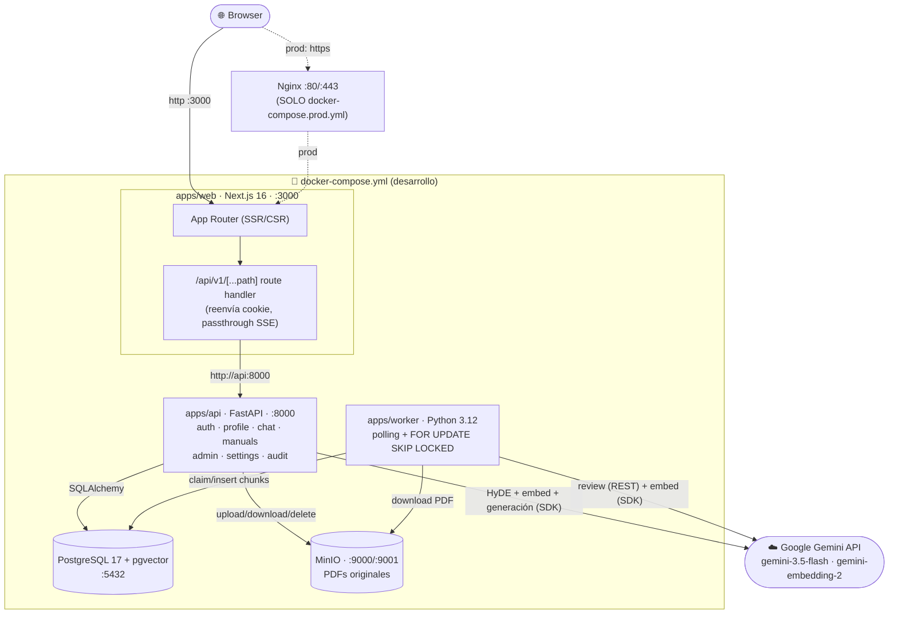
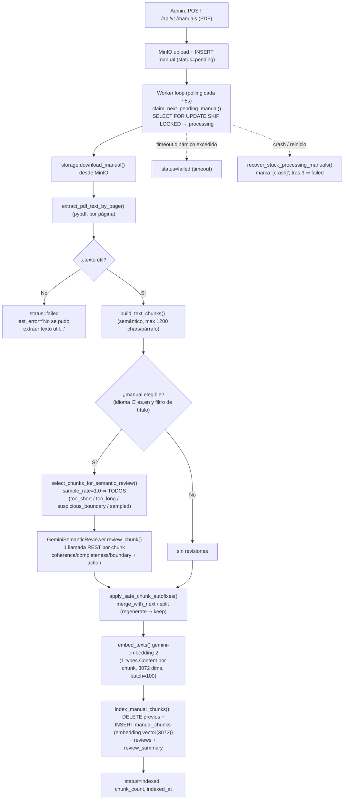
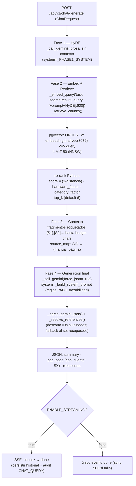
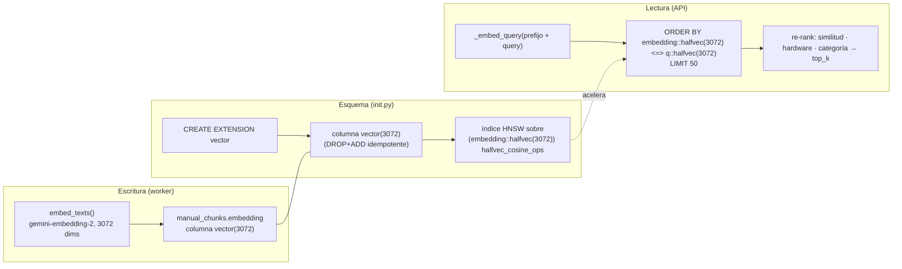
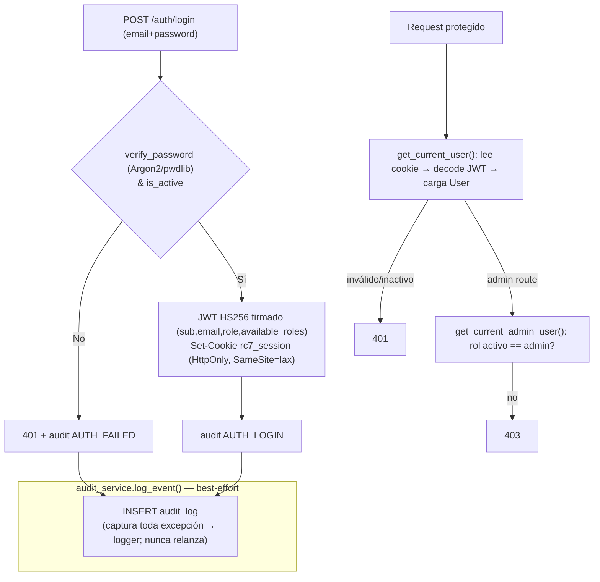
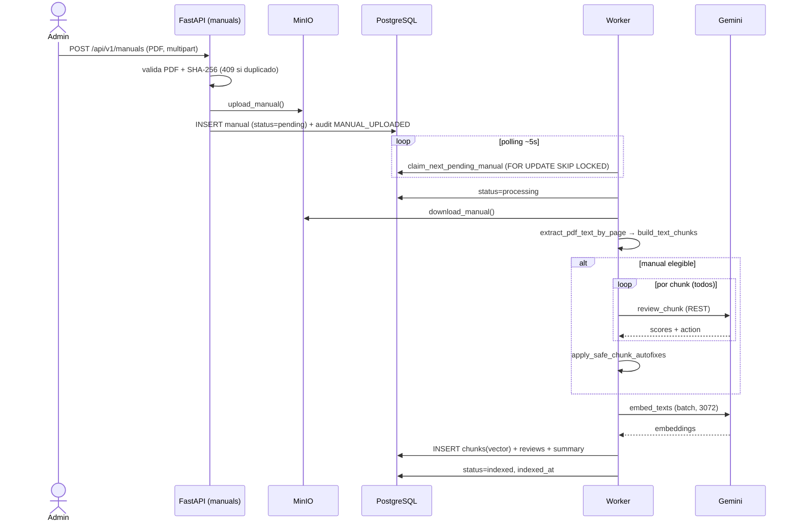
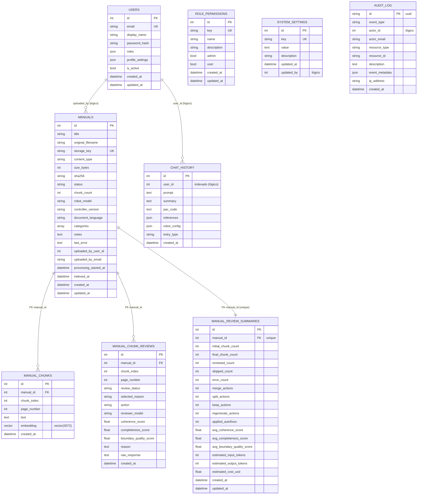

# Arquitectura — RC7 Programming Assistant

> Estos diagramas describen el sistema **como está en el código** (no una versión idealizada).
> Las divergencias con docs anteriores están registradas en
> [docs/audit/DOC_VS_CODE.md](../audit/DOC_VS_CODE.md).

## 1. Componentes y flujos de datos



**Servicios realmente usados:** `web`, `api`, `worker`, `postgres` (imagen `pgvector/pgvector:pg17`),
`minio`. **Nginx existe solo en producción** (`docker-compose.prod.yml`) como terminador TLS/reverse
proxy; en desarrollo no hay nginx y el proxy de Next.js cumple ese rol para `/api/v1/*`.

---

## 2. Pipeline de ingestión (worker)

Implementación real en [jobs/ingestion.py](../../apps/worker/src/jobs/ingestion.py).



Notas reales: la revisión es **exhaustiva** por defecto (`SEMANTIC_REVIEW_SAMPLE_RATE=1.0`, sin tope);
el autofix `regenerate` **no** está implementado (se trata como `keep`); el reviewer usa **REST urllib**
mientras el embedding usa el **SDK** ([CODE_AUDIT S5](../audit/CODE_AUDIT.md)).

---

## 3. Pipeline de consulta RAG (4 fases)

Implementación real en [chat/service.py](../../apps/api/src/services/chat/service.py).



Parámetros configurables en caliente (`system_settings`): `rag_top_k_chunks` (6),
`rag_context_budget_chars` (12000), `gemini_temperature` (0.7), `gemini_max_tokens` (8192),
`system_prompt_pac`, `history_max_entries` (50). El candidato pool (50) y los modelos están
hardcoded ([CODE_AUDIT S1, D1](../audit/CODE_AUDIT.md)).

---

## 4. Almacenamiento y recuperación vectorial



`halfvec`: pgvector limita los índices HNSW de `vector` a 2000 dims; para 3072 se indexa y consulta
vía cast a `halfvec(3072)`. La similitud = `1 − distancia_coseno (<=>)`.

---

## 5. Autenticación y auditoría



**Estado real:** Google SSO **no implementado** (`/auth/providers` solo informa). Hashing con
**Argon2** (`pwdlib.recommended()`), no bcrypt. El audit nunca rompe el flujo principal. Observabilidad =
audit_log + logs rotados a archivo (`api.log` / `worker.log`).

---

## 6. Diagrama de secuencia — Vida de una consulta

```mermaid
sequenceDiagram
    actor U as Usuario
    participant W as Next.js (web)
    participant PX as Proxy /api/v1
    participant A as FastAPI (chat)
    participant DB as PostgreSQL+pgvector
    participant G as Gemini

    U->>W: prompt + config robot
    W->>PX: POST /api/v1/chat/generate (cookie)
    PX->>A: POST (Connection: close, cookie)
    A->>A: get_current_user (401 si falla)
    A->>G: Fase 1 HyDE (prosa)
    G-->>A: respuesta hipotética
    A->>G: Fase 2 embed(query + HyDE)
    G-->>A: vector 3072
    A->>DB: ORDER BY embedding &lt;=&gt; q LIMIT 50
    DB-->>A: candidatos
    A->>A: re-rank hardware+categoría → top_k, source_map
    A->>G: Fase 4 generación (force_json, stream)
    loop tokens
        G-->>A: chunk
        A-->>PX: data: {type:chunk}
        PX-->>W: SSE passthrough
        W-->>U: render incremental
    end
    A-->>PX: data: {type:done, summary, pac_code, references}
    A->>DB: guarda chat_history (poda) + audit CHAT_QUERY
    PX-->>W: done
```

---

## 7. Diagrama de secuencia — Vida de un manual (ingestión)



---

## 8. Modelo de datos (ER)

Relaciones con **FK declarada** = líneas sólidas. Referencias lógicas (columna `int` indexada sin
`ForeignKey`: `chat_history.user_id`, `audit_log.actor_id`, `system_settings.updated_by`,
`manuals.uploaded_by_user_id`) se documentan en nota, no como relación.



`ROLE_PERMISSIONS`, `SYSTEM_SETTINGS` y `AUDIT_LOG` son tablas independientes (sin FK). El modelo
`Manual` del worker es un subconjunto del de la API (no declara `sha256`) — ver
[CODE_AUDIT O2](../audit/CODE_AUDIT.md).
